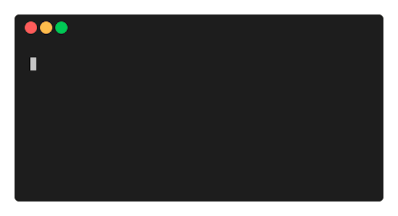

<div align="center">


🏃‍♂️ A little bit fast and modern Ruby version manager written in Rust

[](https://github.com/TaKO8Ki/frum/actions) [](https://crates.io/crates/frum)



</div>

## Features

- Pure Rust implementation not using `ruby-build`
- Cross-platform support (macOS, Linux)
- Works with `.ruby-version` files
- Auto-Completion

## Goals

- **Blazing-Fast Ruby Installation** - built with speed in mind
- **Cross-Platform** - works on macOS, Linux and (Windows)

### Benchmark

| Command | Mean [ms] | Min [ms] | Max [ms] | Relative |
|:---|---:|---:|---:|---:|
| `rbenv` | 239628.1 ± 2030.2 | 237681.6 | 245162.6 | 1.04 ± 0.01 |
| `frum` | 232944.6 ± 1224.0 | 230565.4 | 234863.5 | 1.01 ± 0.01 |
| `frum(pre-release)` | 230366.5 ± 882.7 | 228454.2 | 232340.5 | 1.00 |

For more information, please see [#16](https://github.com/TaKO8Ki/frum/pull/16).

## Installation

### Homebrew

If you’re using Homebrew on macOS, install the `frum` formula.

```
$ brew install tako8ki/tap/frum
```
Daniel Kehoe has written a detailed guide to [Install Ruby with Frum](https://mac.install.guide/ruby/14.html) on macOS using Homebrew.

### Arch Linux

If you’re using Arch Linux, install the [`frum-bin`](https://aur.archlinux.org/packages/frum-bin) package using your favorite AUR helper.

```
$ yay -S frum-bin
```

### Cargo

If you already have a Rust environment set up, you can use the `cargo install` command:

```
$ cargo install frum
```

### Using a release binary (Linux/macOS)

- Download the [latest release binary](https://github.com/TaKO8Ki/frum/releases) for your system
- Set the `PATH` environment variable
- Configure your shell profile

## Usage

### Shell Setup

You need to run some shell commands before using frum. All you have to do is evaluate the output of `frum init`. Check out the following guides for the shell you use:

#### Bash

add the following to your `.bashrc`:

```bash
eval "$(frum init)"
```

#### Zsh

add the following to your `.zshrc`:

```zsh
eval "$(frum init)"
```

#### Fish shell

create `~/.config/fish/conf.d/frum.fish` add this line to it:

```fish
frum init | source
```

### Options

- **--log-level**: The log level of frum commands [default: info] [possible values: quiet, info, error].
- **--ruby-build-mirror**: [default: https://cache.ruby-lang.org/pub/ruby].
- **--frum-dir**: The root directory of frum installations [default: $HOME/.frum].

### Subcommands

- **init**: Sets environment variables for initializing frum.
- **install**: Installs the specified Ruby version.
    - **-l**, **--list**: Lists the Ruby versions available to install.
- **uninstall**: Uninstall a specific Ruby version.
- **versions**: Lists installed Ruby versions.
- **global**: Sets the global Ruby version.
- **local**: Sets the current Ruby version.
- **clean**: Remove old downloads.

### Ruby configuration options

Options to configure Ruby can be passed to the `frum install` command.

```sh
$ frum install --with-openssl-dir=<ssl_dir> # Specify the OpenSSL directory
$ frum install --with-jemalloc # Use jemalloc as allocator
```

You can also specify many other options that will be listed when running `./configure -h`.

## Contribution

Contributions, issues and pull requests are welcome!

## Reference

- [Schniz/fnm](https://github.com/Schniz/fnm)
